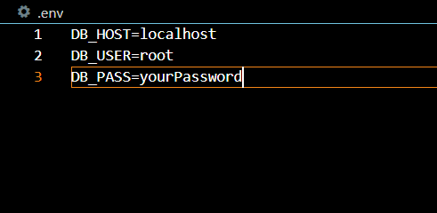

# E- Commerce Back End 

## Description
### Project Aim ###
Finish creation of back end for an E-commerce site. Uses express.js to create API routes and Sequelize to interact with a MySQL database. Demonstrates the API routes with Insomnia. 

### What I Learnt ###
How to make CRDUD API routes, use Sequelize in conjuction with MySQL.

## Deployment
You can view the [walkthrough video here](https://youtu.be/TX5HGjXIMPI). 

## Table of Contents
- [Description](#description)
- [User Story](#user-story)
- [Screenshots](#screenshots)
- [Installation](#installation)
- [Features](#features)
- [Technology](#technology)
- [Contributors](#contributors)
- [Acknowledgements](#acknowledgements)
- [Testing](#testing)
- [License](#license)
- [Questions](#questions)

## User Story
GIVEN a functional Express.js API

WHEN I add my database name, MySQL username, and MySQL password to an environment variable file

THEN I am able to connect to a database using Sequelize

WHEN I enter schema and seed commands

THEN a development database is created and is seeded with test data

WHEN I enter the command to invoke the application

THEN my server is started and the Sequelize models are synced to the MySQL database

WHEN I open API GET routes in Insomnia Core for categories, products, or tags
THEN the data for each of these routes is displayed in a formatted JSON

WHEN I test API POST, PUT, and DELETE routes in Insomnia Core

THEN I am able to successfully create, update, and delete data in my database

## Screenshots
The following animation shows the application's GET routes to return all categories, all products, and all tags being tested in Insomnia Core:

The following animation shows the application's GET routes to return a single category, a single product, and a single tag being tested in Insomnia Core:

The following animation shows the application's POST, PUT, and DELETE routes for categories being tested in Insomnia Core:

## Installation
You will need: 
Node.js, MySQL2, Sequelize, Express.js, 

1. Clone the repo to your computer and open it with VS Code
2. Install Node.js if not already installed
4. Create a .env file in the root directory and input your MySQL login details in it, instead of DB_HOST we're going to use DB_NAME: ecommerce_db in this project.

[MySQL server login guide here](https://www.mysqltutorial.org/install-mysql/)

5. Start the MySQL database server by running mysql -u whatever user you set -p in the Terminal, you'll then be prompted to enter your password, do so and hit enter

6. Then type USE ecommerce_db to create the database.

7. Open another Terminal and run npm i and npm start to start the server.

8. Open Insomnia and test the routes e.g. http://localhost:3002/api/categories to get all categories etc.

## Features
- Can create, read, update, delete products, categories and ids.

## Technology
- MySQL
- Node.js
- Sequelize
- Express.js

## Contributors
[Zachary Hobba](https://github.com/HobbaZ)

You can also contribute by opening a pull request or submitting an issue

## Acknowledgements

[BelongsTo and has associations](https://sequelize.org/v5/manual/associations.html)

[Sequalize, Node.js and Express setup guide](https://www.bezkoder.com/node-js-express-sequelize-mysql/)

## Testing
No testing has been created for this project.

## License

MIT

**Copyright 2021 Zachary Hobba**

Permission is hereby granted, free of charge, to any person obtaining a copy of this software and associated documentation files (the "Software"), to deal in the Software without restriction, including without limitation the rights to use, copy, modify, merge, publish, distribute, sublicense, and/or sell copies of the Software, and to permit persons to whom the Software is furnished to do so, subject to the following conditions:
The above copyright notice and this permission notice shall be included in all copies or substantial portions of the Software.
    
THE SOFTWARE IS PROVIDED "AS IS", WITHOUT WARRANTY OF ANY KIND, EXPRESS OR IMPLIED, INCLUDING BUT NOT LIMITED TO THE WARRANTIES OF MERCHANTABILITY, FITNESS FOR A PARTICULAR PURPOSE AND NONINFRINGEMENT. IN NO EVENT SHALL THE AUTHORS OR COPYRIGHT HOLDERS BE LIABLE FOR ANY CLAIM, DAMAGES OR OTHER LIABILITY, WHETHER IN AN ACTION OF CONTRACT, TORT OR OTHERWISE, ARISING FROM, OUT OF OR IN CONNECTION WITH THE SOFTWARE OR THE USE OR OTHER DEALINGS IN THE SOFTWARE.

## Questions

Find me on Github at [HobbaZ](https://github.com/HobbaZ)
Email me at [zachobba@gmail.com](zachobba@gmail.com)